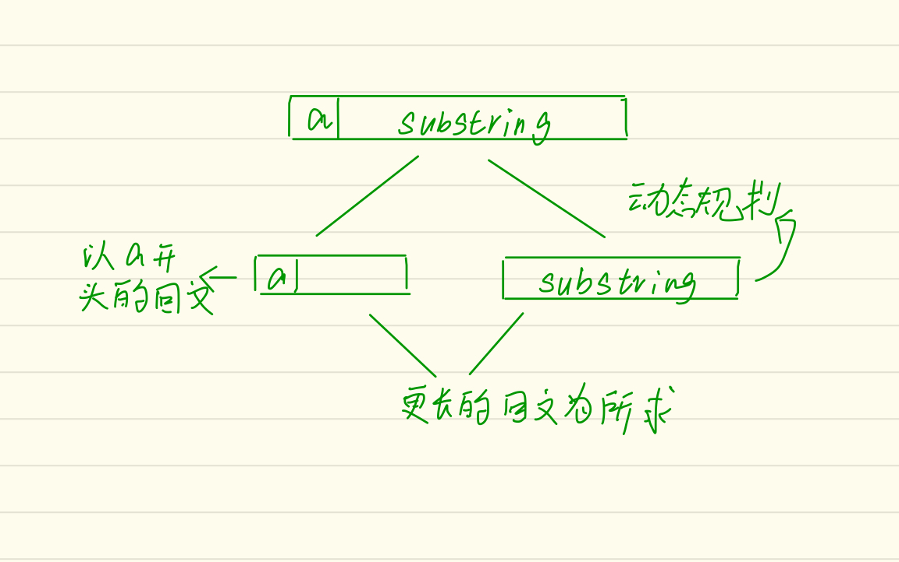

# 5. Longest Palindromic Substring

## 题目说明

Given a string **s**, find the longest palindromic substring in **s**. You may assume that the maximum length of **s** is 1000.

**Example 1:**

```
Input: "babad"
Output: "bab"
Note: "aba" is also a valid answer.
```

**Example 2:**

```
Input: "cbbd"
Output: "bb"
```

## vesion-1

- 这是动态规划下面的题目，思路如下
- 

- 将问题分解，找到以首字母开头的最长的回文串，与剩余部分最长回文比较
- 该版本的运行时间约600ms

## version-2

- 在参考[讨论区](https://leetcode.com/problems/longest-palindromic-substring/discuss/2928/Very-simple-clean-java-solution)后对上述代码进行优化
- 其实在找以首字母开头的最长回文串只用确定两个长度的子串是否是回文即可，长度分别为maxPalindrome+1和maxPalindrome+2
- 相比于讨论区的代码，我的代码可能更加易懂，但是看起来没有那么简洁