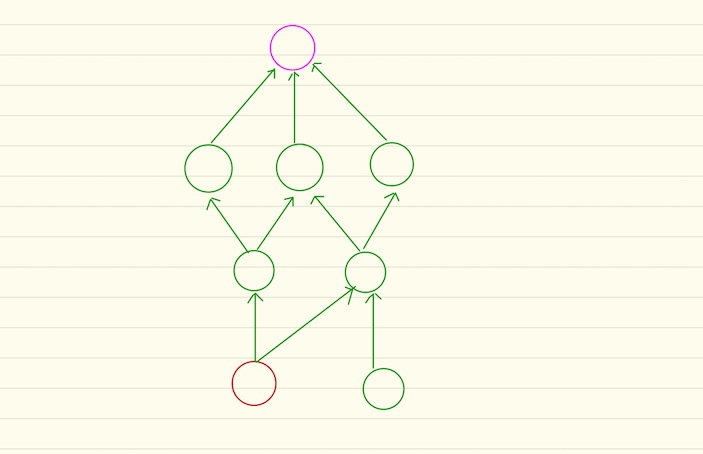

# 126. Word Ladder II

## 题目说明

Given two words (*beginWord* and *endWord*), and a dictionary's word list, find all shortest transformation sequence(s) from *beginWord* to *endWord*, such that:

1. Only one letter can be changed at a time
2. Each transformed word must exist in the word list. Note that *beginWord* is *not* a transformed word.

**Note:**

- Return an empty list if there is no such transformation sequence.
- All words have the same length.
- All words contain only lowercase alphabetic characters.
- You may assume no duplicates in the word list.
- You may assume *beginWord* and *endWord* are non-empty and are not the same.

**Example 1:**

```
Input:
beginWord = "hit",
endWord = "cog",
wordList = ["hot","dot","dog","lot","log","cog"]

Output:
[
  ["hit","hot","dot","dog","cog"],
  ["hit","hot","lot","log","cog"]
]
```

**Example 2:**

```
Input:
beginWord = "hit"
endWord = "cog"
wordList = ["hot","dot","dog","lot","log"]

Output: []

Explanation: The endWord "cog" is not in wordList, therefore no possible transformation.
```


## version-1

- 首先，这是我第一次用java解决比较复杂的问题，在写代码的过程中遇到不少语法问题，在最终把代码跑通后，很遗憾地超时了！！！下面对我的解题思路进行简要说明，并进行问题分析
- 这道题是在回溯板块下面找到的，非常顺其自然地想到了回溯的解法。题面和之前解的一道在棋盘上找字符串的题很类似，只不过这里相邻关系不是由位置决定，而是由两者之间相异的字符个数决定。根据这一点，我先找到每个字符串的“邻居”节点集，之后从起始节点开始进行递归探索邻居节点，在这个过程中记录点的探索情况（已经访问的节点不再访问）并记录当前的探索路径，一直到探索到目标节点就添加当前路径到列表。
- 按照上面思路写出的代码（见version-1）运行结果是超时，对于前十几个测试样例能够成功通过，但是对于WordList规模稍大的测试样例便会失败。
- 我对此进行了思考，上面的思路进行的是深度优先搜索，但是题目要求的是最短路径，利用深度优先实际在许多不用探索的路径上投入了大量时间


## version-2

- 有了上面的失败经验，这一次我首先利用BFS构造出一棵树，如下图所示

  

- 紫色的是beginWord，红色的是endWord，从紫色节点开始进行广度优先搜索，一直到红色节点入队列为止。在探索过程中，构建一棵反向的BFS搜索树。

- 根据上面的树，从红色节点开始运行深度搜索，利用回溯即可获得所有最短路径。

- 本来以为这个版本的程序运行地会很快，不过测试结果却不是很如意，这一点让我有点疑惑。不过测试样例都能通过。